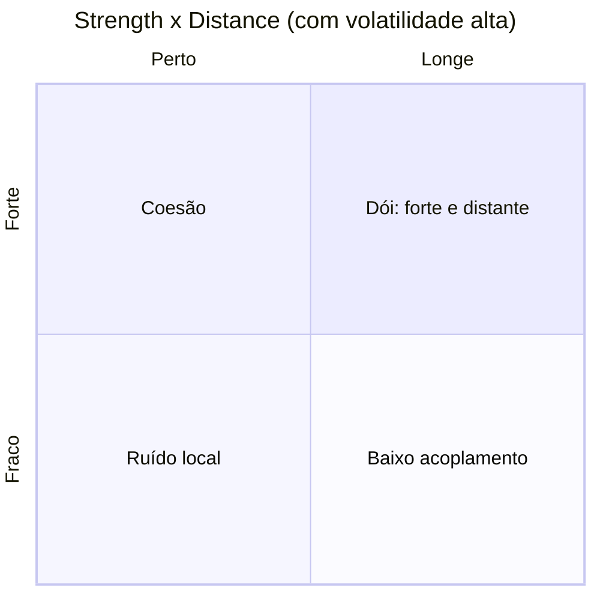

# Acoplamento

"Desacoplar" é o conselho mais repetido em arquitetura e um dos menos úteis — porque acoplamento não é ruim em si. Dois componentes que precisam mudar juntos **devem** estar acoplados; o problema é quando estão acoplados **e longe um do outro e mudando o tempo todo**.

Esta seção usa o modelo de Vlad Khononov, de *Balancing Coupling in Software Design*, que troca a pergunta "está acoplado?" por três perguntas mais precisas.

## As três dimensões

| Dimensão | Pergunta | Nota |
|---|---|---|
| **Integration strength** | *O que* é compartilhado entre os componentes? | [Integration strength](integration-strength.md) |
| **Distance** | *Onde* o acoplamento vive fisicamente? | [Distance e volatility](distance-e-volatility.md) |
| **Volatility** | *Com que frequência* os componentes mudam? | [Distance e volatility](distance-e-volatility.md) |

## A ideia central em uma linha

```
equilíbrio = (strength XOR distance) OR NOT volatility
```

Traduzindo:

- **Forte e perto** é coesão — o que muda junto mora junto. Bom.
- **Fraco e longe** é baixo acoplamento — contratos estreitos entre partes distantes. Bom.
- **Estável** tolera quase tudo — acoplamento forte com algo que nunca muda não cobra juros.
- **Forte, longe e volátil** é o trio que dói: toda mudança atravessa uma fronteira cara.



O passo a passo para aplicar isso num código real — com tabela de diagnóstico, cálculo do esforço de manutenção e scripts para medir — está em [Balanceamento](balanceamento.md).

## O que esta seção não cobre

- Acoplamento **dentro** de um módulo (uma classe que muda por vários motivos, uma mudança que toca várias classes) é território dos code smells: [Shotgun Surgery](../modelagem-de-dominio/code-smells/shotgun-surgery.md) e [Divergent Change](../modelagem-de-dominio/code-smells/divergent-change.md).
- **Onde traçar** as fronteiras é DDD estratégico: [Bounded contexts](../ddd-estrategico/bounded-contexts.md). Esta seção mede as dependências entre fronteiras já traçadas.

## Leitura

- Vlad Khononov — *Balancing Coupling in Software Design* (Addison-Wesley)
- Meilir Page-Jones — o trabalho original sobre *connascence*, que o modelo usa para graduar a força
