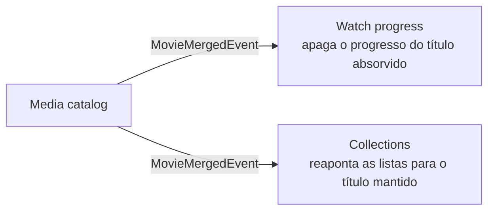

# Eventos entre contextos

O [read port](read-ports.md) resolve "preciso de um dado de outro contexto". O evento resolve o problema inverso: **"aconteceu algo aqui, e outros contextos precisam reagir"** — sem que o contexto de origem saiba quem são eles.

## Quando usar evento em vez de chamada

| Use chamada (read port) quando… | Use evento quando… |
|---|---|
| O consumidor precisa da resposta para continuar. | O publicador não precisa de resposta. |
| A relação é de leitura. | A relação é de reação a um fato. |
| Há um consumidor específico. | Pode haver zero, um ou vários interessados. |

A diferença de dependência é o ponto principal. Com chamada, quem chama conhece o chamado. Com evento, **quem publica não conhece quem reage** — a seta de dependência se inverte, e um novo interessado entra sem tocar no publicador.

## Um exemplo real

No HomeFlix, quando dois filmes duplicados são mesclados pela fila de conflitos, o catálogo publica `MovieMergedEvent`. Dois contextos reagem, cada um com sua regra:



O handler de *Watch progress*:

```python
class OnMovieMergedHandler(EventHandler):
    """Wipe every watch_progresses row pointing at the loser movie."""

    async def handle(self, event: DomainEvent) -> None:
        if not isinstance(event, MovieMergedEvent):
            return
        async with self._uow_factory() as uow:
            deleted = await uow.progress.delete_all_for_movie(event.loser_id)
```

Repare em duas decisões. A primeira: o catálogo não sabe que progresso e listas existem — ele anuncia um fato. A segunda: cada contexto decide **o que o fato significa para ele**. Para listas, o certo é reapontar para o filme mantido. Para progresso, o código preferiu apagar, porque os dois filmes podem ser cortes diferentes (versão do diretor e versão de cinema) e mapear a posição de um para o outro seria inventar dado.

Os eventos que atravessam contextos moram em `shared_kernel/integration_events` — um pequeno vocabulário publicado que todos podem importar sem depender uns dos outros.

## O preço do evento em processo

O HomeFlix usa um bus em memória: os handlers rodam em sequência, no mesmo processo, e uma exceção num handler é registrada no log mas **não** derruba o publicador. Isso é simples e suficiente para um monólito, mas tem custos que precisam ser conscientes:

!!! warning "Fire-and-forget"
    - **Sem atomicidade.** A mesclagem é confirmada e o handler roda depois. Se o handler falhar, o catálogo já reportou sucesso e o progresso órfão fica lá — só um log registra.
    - **Sem durabilidade.** Se o processo cair entre o commit e o handler, o evento se perde.
    - **Sem retry.** Uma falha transitória (banco ocupado) é tratada igual a uma falha permanente.

A saída clássica é o **outbox pattern**: o evento é gravado na mesma transação da mudança, e um processo separado o entrega com retry. Ele está no roadmap do HomeFlix — e o fato de ainda não estar lá é uma decisão razoável: para um servidor doméstico, um progresso órfão ocasional custa menos do que a infraestrutura de entrega garantida.

!!! tip "Projete o handler como se o outbox já existisse"
    Mesmo sem outbox, escreva handlers **idempotentes**: processar o mesmo evento duas vezes não pode quebrar nada. O handler acima já é — apagar o que já foi apagado não faz nada. Quando a entrega com retry chegar, nenhum handler precisa mudar.

## Evento de domínio, evento de integração

Vale separar os dois:

- **Evento de domínio** é interno a um contexto. O agregado registra o fato (`add_event`), e o use case drena e publica depois do commit.
- **Evento de integração** é o contrato publicado para outros contextos. Ele carrega só o que os consumidores precisam — ids e o mínimo de contexto — e muda com muito mais cuidado, porque é API.

Promover um evento de domínio diretamente para integração acopla os consumidores ao modelo interno do publicador. É o mesmo erro de devolver a entidade num read port, só que em outra forma.

## Relacionados

- [Read ports entre contextos](read-ports.md)
- [Temporal Coupling](../modelagem-de-dominio/code-smells/temporal-coupling.md)
- [Integration strength](../acoplamento/integration-strength.md) — evento bem desenhado é *contract coupling*
