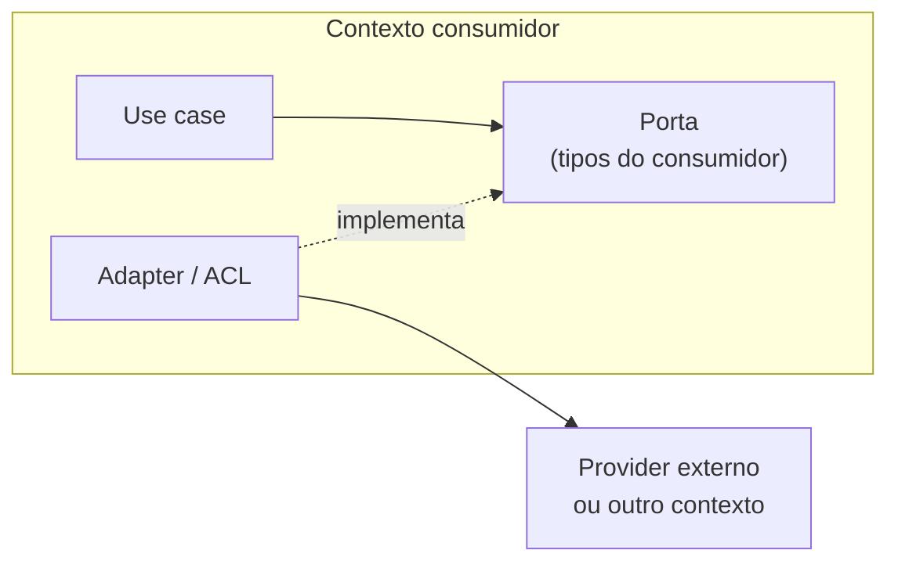

# Arquitetura de fronteiras

Todo sistema tem pontos onde algo de fora entra: a resposta de uma API de terceiro, o modelo de outro bounded context, um evento. Esses pontos são onde o modelo de domínio mais se corrompe — e onde os bugs mais caros se escondem, porque ninguém olha para a borda como lugar de regra de negócio.

Esta seção trata de três tipos de fronteira:

| Fronteira | Ferramenta | Nota |
|---|---|---|
| Sistema → mundo externo | **Anti-Corruption Layer** | [Anti-Corruption Layer](acl.md) e [os 8 eixos de auditoria](acl-eixos.md) |
| Contexto → contexto (leitura) | **Read port + adapter** | [Read ports entre contextos](read-ports.md) |
| Contexto → contexto (reação) | **Evento de domínio** | [Eventos entre contextos](eventos-entre-contextos.md) |

## A mesma regra nas três

Por trás das três ferramentas há uma regra só:

> **Quem consome define o contrato. Quem fornece não vaza o próprio modelo.**

Na ACL, o domínio define o que precisa e o adapter traduz o provider para isso. No read port, o contexto consumidor define a porta com seus próprios tipos. No evento, o publicador anuncia um fato sem saber quem reage. Em todos os casos, a fronteira é o lugar onde um modelo **termina** e outro **começa** — e nada atravessa sem tradução.

## Relacionados

- [Context map](../ddd-estrategico/context-map.md) — os padrões de integração em nível estratégico
- [Integration strength](../acoplamento/integration-strength.md) — como medir o que atravessa cada fronteira
