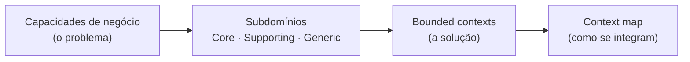

# DDD Estratégico

DDD tático é sobre **como modelar dentro de uma fronteira**: entities, value objects, agregados. DDD estratégico vem antes e responde outra pergunta: **onde ficam as fronteiras**.

Errar no tático custa um refactoring. Errar no estratégico custa uma reescrita — porque a fronteira errada espalha cada mudança por vários módulos e mistura vocabulários que deveriam estar separados.

## O caminho do problema à solução

1. **Subdomínios** descrevem o *problema*: que capacidades o negócio tem e quanto cada uma vale.
2. **Bounded contexts** descrevem a *solução*: onde o código traça fronteiras de modelo e de linguagem.
3. **Context map** descreve as *relações*: quem depende de quem, e com que padrão de integração.

O ideal é um subdomínio para um bounded context. Na prática a correspondência se desalinha com o tempo — e perceber esse desalinhamento é metade do trabalho.

## Notas desta seção

| Nota | Pergunta que responde |
|---|---|
| [Subdomínios](subdominios.md) | O que é Core, Supporting e Generic — e por que isso decide onde investir design. |
| [Bounded contexts](bounded-contexts.md) | Por que a fronteira é linguística antes de ser técnica, e como achá-la. |
| [Context map](context-map.md) | Os padrões de integração entre contextos e quando cada um faz sentido. |
| [Coesão e problemas de fronteira](coesao-e-fronteiras.md) | Como medir se uma fronteira está boa e os cinco erros de fronteira mais comuns. |

!!! info "Onde isto encontra o resto da base"
    A classificação de subdomínios alimenta diretamente a dimensão *volatility* da [análise de acoplamento](../acoplamento/index.md). E a fronteira com sistemas externos é tratada em [Arquitetura de fronteiras](../arquitetura-de-fronteiras/index.md).

## Leituras de base

- Eric Evans — *Domain-Driven Design* (a parte IV, "Strategic Design", é a que importa aqui)
- Vaughn Vernon — *Implementing Domain-Driven Design*
- Vlad Khononov — *Learning Domain-Driven Design*
