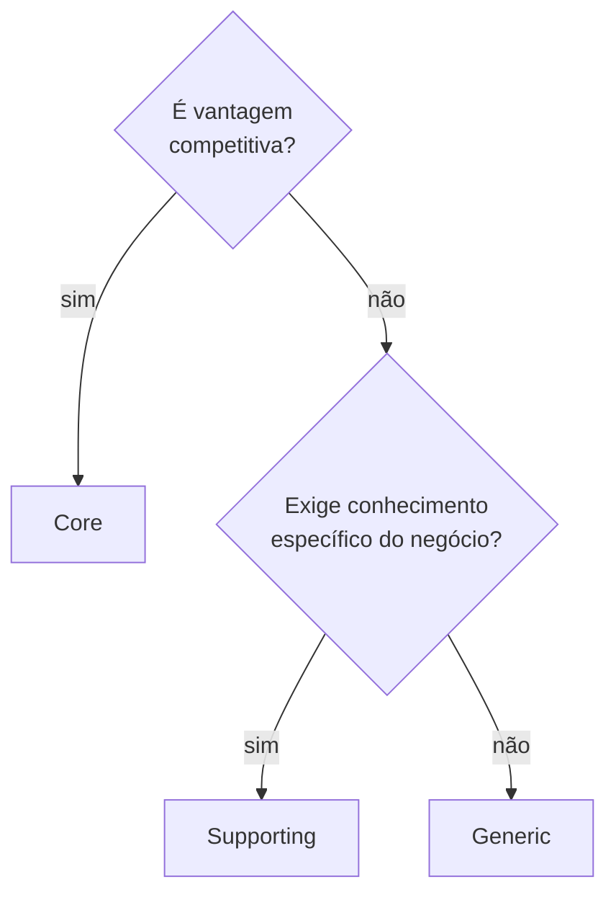

# Subdomínios: Core, Supporting e Generic

Nem toda parte do sistema merece o mesmo esforço. Classificar subdomínios é a forma explícita de decidir **onde gastar design rico e onde aceitar a solução mais barata que funciona**.

## Os três tipos

| Tipo | O que é | Sinais |
|---|---|---|
| **Core** | Onde está a vantagem competitiva. O motivo de o sistema existir. | Lógica complexa e própria, muda com frequência, exige alguém que entenda do negócio. |
| **Supporting** | Necessário e específico do negócio, mas não diferencia. | Apoia o core, complexidade moderada, regras próprias da empresa. |
| **Generic** | Problema resolvido. Poderia ser comprado ou terceirizado. | Funcionalidade padrão: autenticação, e-mail, storage, geração de PDF. |

## Árvore de decisão

Duas perguntas rápidas que costumam resolver os casos ambíguos:

- **É core?** *Se um concorrente copiasse só essa parte, doeria?* Se sim, é core.
- **É generic?** *Existe um SaaS ou uma biblioteca que resolve isso igual ou melhor?* Se sim, é generic.

## Por que a classificação importa na prática

A classificação não é taxonomia por taxonomia. Ela decide três coisas:

1. **Onde modelar com rigor.** Core merece agregados ricos, invariantes no tipo, refatoração contínua. Generic merece a integração mais simples possível.
2. **Onde aceitar dívida.** Dívida em generic estável raramente cobra juros. Dívida no core cobra todo sprint.
3. **O que comprar em vez de construir.** Generic é candidato natural a lib ou serviço externo.

!!! warning "Os dois erros simétricos"
    **Overengineering no generic** — agregado rico, eventos e ADR para um envio de e-mail. **Anemia no core** — a regra que é a razão de o produto existir espalhada em services e `if`s. O segundo é muito mais caro.

## Generic não quer dizer "estável"

A heurística comum diz que generic tem volatilidade baixa. Isso vale quando você **compra** o genérico. Quando você **constrói** o genérico do zero, ele pode ser a parte que mais muda.

No [HomeFlix](../estudos-de-caso/homeflix/index.md), o streaming (HLS, transcodificação, detecção de abertura) foi classificado como *Generic* — é um problema resolvido por Jellyfin e Plex. Mesmo assim, foi o subdomínio com mais commits concentrados quando o módulo de catálogo foi auditado. A classificação continuou correta; o que mudou foi a leitura de volatilidade, que tem que vir do histórico real e não só do rótulo. Isso aparece de novo em [Distance e volatility](../acoplamento/distance-e-volatility.md).

## Classificação é hipótese

Classificar subdomínio é um julgamento de negócio, não uma propriedade do código. Valide com quem conhece o negócio, revise quando a estratégia mudar e registre a classificação num lugar que todo mundo leia — um ADR, ou o próprio context map.

## Relacionados

- [Bounded contexts](bounded-contexts.md)
- [Coesão e problemas de fronteira](coesao-e-fronteiras.md)
- [Acoplamento: distance e volatility](../acoplamento/distance-e-volatility.md)
- [Anemic Domain Model](../modelagem-de-dominio/code-smells/anemic-domain-model.md)
