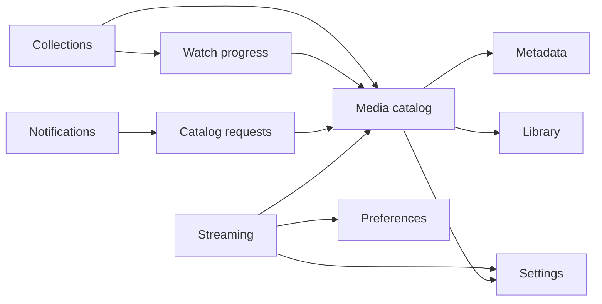

# Mapa de contextos do HomeFlix

## Os onze contextos

A volatilidade abaixo é **medida**: commits por módulo nos seis meses até outubro de 2026, contando só commits que não são merge. A classificação de Streaming e Metadata vem do [ADR-032](https://github.com/lucaschf/homeflix/blob/develop/docs/adr/ADR-032-decompose-media-into-subdomains.md); as demais são minhas, aplicando a [árvore de decisão](../../ddd-estrategico/subdominios.md).

| Contexto | Responsabilidade | Subdomínio | Commits (6 meses) |
|---|---|---|---|
| **Media catalog** | Filmes, séries, temporadas, episódios; busca, deduplicação | Core | 241 |
| **Identity** | Usuários, perfis, sessões, controle de acesso | Supporting\*\* | 41 |
| **Collections** | Watchlist e listas personalizadas | Supporting | 36 |
| **Watch progress** | Posição de reprodução por perfil, "continuar assistindo" | Generic | 34 |
| **Settings** | Configurações de runtime persistidas em banco | Supporting | 29 |
| **Library** | Fontes de mídia (pastas) e regras de escaneamento | Supporting | 25 |
| **Catalog requests** | Pedidos de inclusão de títulos e quem os segue | Supporting | 24 |
| **Preferences** | Idioma, legendas, qualidade, comportamento entre episódios | Supporting | 19 |
| **Notifications** | Entrega de notificações por usuário | Generic | 10 |
| **Metadata** | Integração com TMDB/OMDb, artwork | Supporting | 8\* |
| **Streaming** | HLS, transcodificação, legendas por OCR | Generic | 7\* |

\* Metadata e Streaming foram extraídos do catálogo em agosto de 2026, então seis meses de histórico ainda contam pouco para eles.

\*\* Autenticação em si é genérica, mas Identity também carrega regras específicas da casa — perfis com limite de idade e bibliotecas permitidas. É esse pedaço que o faz Supporting.

## O que os números dizem

**O catálogo concentra metade da mudança.** Somando os commits de cada módulo, `media` responde por 241 de 474 — cerca de 51%. É o core de fato, não só no rótulo. Esse foi o diagnóstico que levou ao ADR-032: um módulo de cerca de 40 mil linhas soldando subdomínios com volatilidades diferentes. A extração de Streaming e Metadata é a resposta — e os 7 e 8 commits deles mostram a mudança começando a sair do catálogo.

**Generic construído em casa é volátil.** Streaming é *Generic* — Jellyfin e Plex resolvem o mesmo problema. Mesmo assim, foi o subdomínio com mais commits concentrados dentro do catálogo antes da extração. É o exemplo usado em [Distance e volatility](../../acoplamento/distance-e-volatility.md): o rótulo descreve o negócio, o git descreve o custo.

## Quem depende de quem

Leituras síncronas (consumidor → provedor), apurando os imports reais entre módulos:

Fora do diagrama: todos os contextos autenticam pelo contrato publicado de Identity ([ADR-024](https://github.com/lucaschf/homeflix/blob/develop/docs/adr/ADR-024-published-presentation-contracts-cross-bc.md)), e o catálogo também lê de Streaming, Library, Watch progress e Catalog requests para montar suas telas.

Reações entre contextos vão por eventos em processo:

| Evento | Publicado por | Tratado por |
|---|---|---|
| `MediaEnriched` | Media catalog | Catalog requests (fecha o pedido e notifica quem segue) |
| `MovieMerged` | Media catalog | Watch progress, Collections |
| `MoviePromotedToSeries` | Media catalog | Watch progress, Collections |
| `UserDeleted` | Identity | Watch progress, Collections |

## Os pares que mudam juntos

Co-change nos mesmos seis meses — commits que tocaram mais de um módulo:

| Par | Commits juntos |
|---|---|
| Media + Settings | 13 |
| Media + Watch progress | 6 |
| Library + Media | 5 |
| Catalog requests + Media | 5 |
| Media + Streaming | 4 |
| Catalog requests + Notifications | 3 |

O par do topo é o mais interessante, e ele reaparece na [auditoria de acoplamento](auditoria-de-acoplamento.md): `media` importa value objects do domínio de `settings`, e os dois mudam juntos mais do que qualquer outro par.

## Relacionados

- [Subdomínios](../../ddd-estrategico/subdominios.md)
- [Context map](../../ddd-estrategico/context-map.md)
- [Eventos entre contextos](../../arquitetura-de-fronteiras/eventos-entre-contextos.md)
